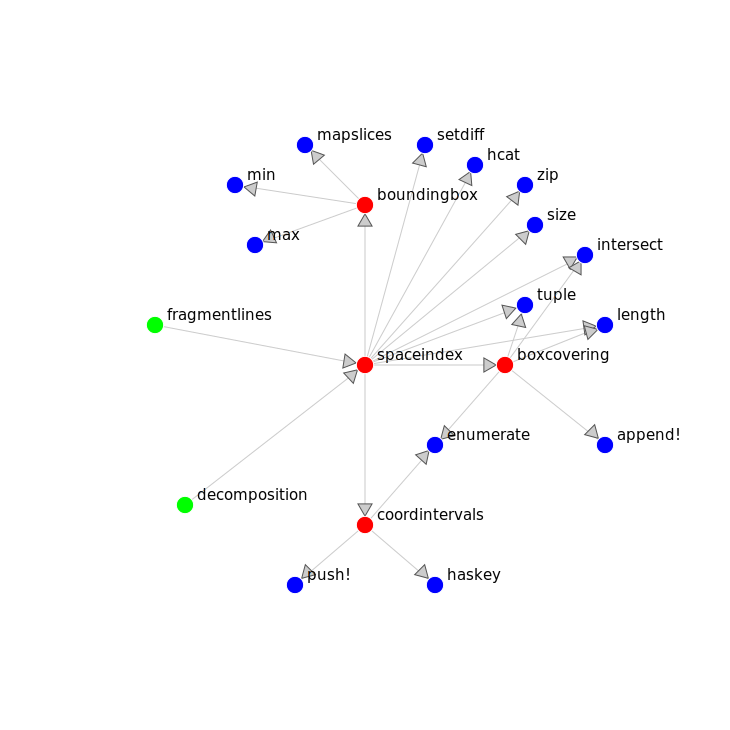
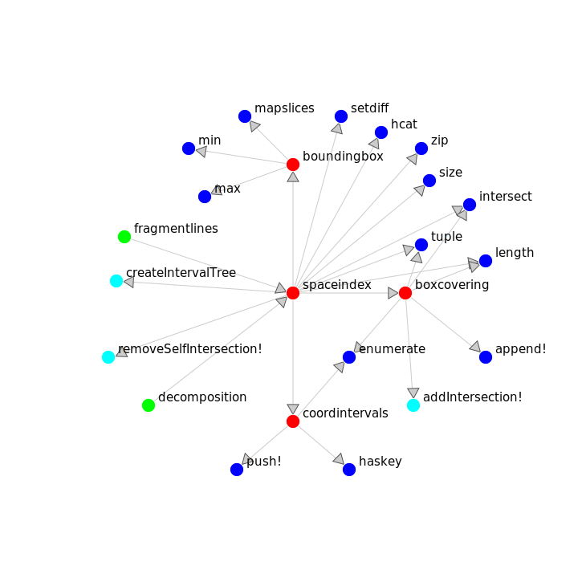
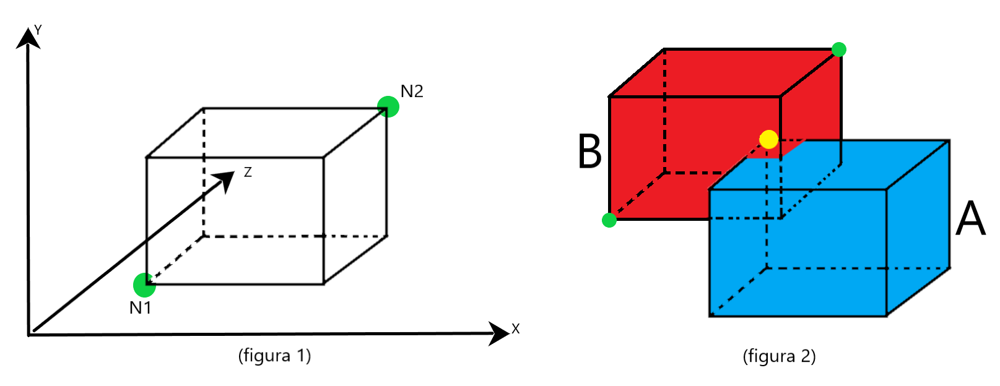
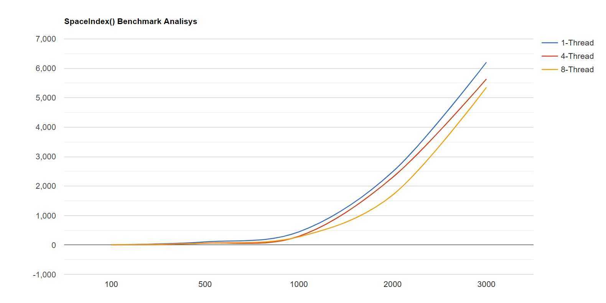
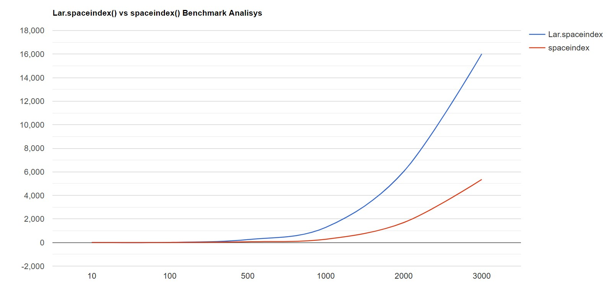

# IntervalTrees

**Muti Mattia, Minerva Mattia.**

[matmut248/IntervalTree.jl: Progetto Calcolo Parallelo e Distribuito 2020
(github.com)](https://github.com/matmut248/IntervalTree.jl)

Analisi, revisione e testing della funzione spaceindex(model::Lar.LAR)::Array{Array{Int,1},1}
nel file <https://github.com/cvdlab/LinearAlgebraicRepresentation.jl/blob/master/src/refactoring.jl>

## OBIETTIVI

( 1 parte )

- studio della funzione "spaceindex" e di tutte le funzioni e strutture dati utilizzate da essa.

- descrivere per ogni task ( funzione ) individuata, tipo e significato di ogni parametro e valore di ritorno. 

- suddivisione della funzione in singoli task.

( 2 parte )

- stimare comportamenti e tempi delle singole funzioni puntando all'ottimizzazione delle stesse.

- ottenere la stabilità di tipo.

- produrre test significativi e verificarne la corretta esecuzione.

- parallelizzare dove possibile.

## Analisi Preliminare

**Analisi input e output della funzione "spaceindex"**

-   boundingBox: prende in input un vertice di tipo Lar.Points, ovvero una matrice MxN dove M è la dimensione dello spazio in analisi e N è il numero di vertici, restituisce in output due array che indicano gli estremi del bounding box.

-   coordIntervals: prende in input un array di array (i bounding box) e un intero che serve a specificare su quale coordinata si sta lavorando, restituisce in output un dizionario ordinato.

-   Boxcovering: prende in input un array di array (i bounding box), un intero
che indica su quale coordinata si sta lavorando, e un intervalTrees,
Restituisce in output un array di array che contiene tutte le intersezioni
tra bounding box.

-   spaceIndex: prende in input una tupla costituita da una matrice che contiene
i punti del modello, e da un array di array che contiene le celle cioè
scomposizioni dello spazio geometrico (vertici, lati, facce...). Restituisce un array di array dove l'elemento i-esimo rappresenta quali intersezioni ha
il bounding box i-esimo con gli altri bounding box.

## Relazione di progetto

**Descrizione dei task:**

- boundingBox: serve a creare il bounding box di un segmento, cioè la scatola di misura più piccola (area, volume, ipervolume) entro cui sono contenuti tutti i punti.

- coordIntervals: crea un dizionario ordinato dove la chiave è l'intervallo sulla singola coordinata, mentre il valore associato è un array di indici che indicano a quali bounding box si riferiscono.

- boxCovering calcola quali bounding box si intersecano tra di loro.

- spaceIndex: dato un modello geometrico, calcola le intersezioni tra i bounding box. Nello specifico, la funzione calcola le 1-celle e il loro bounding box attraverso la funzione boundingBox. Si suddividono le coordinate *x* e *y* in due dizionari chiamando la funzione coordintervals. Per entrambe le coordinate *x* e *y*, si calcola un intervalTree cioè una struttura dati che contiene intervalli. La funzione boxCovering viene chiamata per calcolare le sovrapposizioni sulle singole dimensioni dei bounding Box. Intersecando quest’ultime, si ottengono le intersezioni effettive tra bounding box. La funzione esegue lo stesso procedimento sulla coordinata *z* se presente. Infine, si eliminano le intersezioni di ogni bounding box con loro stessi.

**individuazione e descrizione delle funzioni di Base utilizzate dalla funzione spaceindex:**

hcat : concatena due array lungo due dimensioni.

minimum : restituisce il risultato più piccolo di una funzione che viene chiamata su ogni elemento dell'array passato come parametro.

maximum : restituisce il risultato più grande di una funzione che viene chiamata su ogni elemento dell'array passato come parametro.

settdiff : date due collezioni, restituisce gli elementi che sono presenti nel primo insieme ma non nel secondo, se un elemento è presente in entrambi gli insiemi viene rimosso.

intersect: restituisce l’intersezione di due insiemi.

zip: dati due array della stessa lunghezza, crea coppie di elementi.

length: ritorna il numero di elementi dell’array in ingresso.

tuple : costruisce una tupla con i parametri dati in input.

size : restituisce una tupla contenente le dimensioni dell’input. E’ possibile specificare una dimensione per ottenere solo la lunghezza di tale dimensione.

enumerate : un iteratore che produce (i, x) dove i è un contatore a partire da 1, e x è il valore i-esimo della collezione su cui scorre l'iteratore dato.

append!(c, c2)  : per un contenitore ordinato c, aggiunge gli elementi di c2 a c.

haskey : determina se una collezione ha una mappatura per una determinata chiave.

push! : inserisce uno o più item nella collezione. Se la collezione è ordinata, gli item vengono inseriti alla fine (nell'ordine specificato).

Mapslices: trasforma le dimensioni date dell'array in input usando una funzione scelta dall’utente. La funzione è chiamata su tutte le dimensioni ( slices ) dell’array.

min: restituisce il minimo degli argomenti.

max: restituisce il massimo degli argomenti.

funzione che chiama spaceindex:

fragmentlines(model): prende in input il modello e anche grazie a spaceindex calcola e restituisce vertici e spigoli del modello.

**Suddivisione delle funzioni in mono-task:**

- addIntersection!(covers::Array{Array{Int64,1},1}, i::Int, iterator)
aggiunge gli elementi di iterator nell’i-esimo array di covers.

- createIntervalTree(boxdict::AbstractDict{Array{Float64,1},Array{Int64,1}})dato
un dizionario ordinato crea un intervalTree, ovvero una struttura dati che
contiene intervalli e che consente di trovare in modo efficiente tutti gli
intervalli che si sovrappongono a un determinato intervallo o punto.

- removeSelfIntersection!(covers::Array{Array{Int64,1},1})
elimina le intersezioni di ogni bounding box con loro stessi.

## Analisi Definitiva

**Analisi della stabilità di tipo**

Lo studio del progetto è iniziato dalla comprensione del codice di intervalTree.jl per capire come fosse strutturato un interval tree e quindi essere in grado di manipolare le strutture dati ad esso associate.
Dopo di che si è passati allo studio della funzione spaceindex attraverso varie simulazioni della stessa evidenziando così un'instabilità di tipo su alcune sue variabili grazie all'uso della macro @code_warntype, oltre ad una velocita di esecuzione non proprio ottimale. Per risolvere questi problemi, si sono dovute studiare tutte le singole sotto-funzioni in particolare quelle che sollevavano l'instabilità sul tipo:

- boundingbox: la versione iniziale era type unstable; questo era dovuto alla funzione mapslices ( funzione di Base ). Per ovviare al problema, si è effettuato un refactoring della funzione , riscrivendola di fatto da zero. In questo modo si è ottenuta la stabilità di tipo e un notevole miglioramento delle prestazioni di circa sei volte.

- boxcovering: è type stable ma la variabile covers è un array di array di Any. Si è proceduto tipizzando covers e dividendo la funzione in microtask. Dopo il refactoring, si può apprezzare come la nuova versione non migliora molto i tempi di esecuzione, ma rende la variabile covers type stable.

Altre sotto-funzioni type stable invece sono state studiate per comprendere il funzionamento del codice e analizzare i tempi di esecuzione:

- coordintervals: si riscontrano tempi piuttosto rapidi attraverso l'uso della macro benchmark in quanto per la sua esecuzione impiega min = 1.6 micros, mean = 2.1 micros, max = 400 micros.

- createIntervalTree: utilizzando la macro benchmark si sono riscontrati i tempi di esecuzione, min = 931 ns, mean = 1.2 micros, max = 58.7 micros. 

- addIntersection!: funzione creata durante lo studio della funzione spaceindex come micro-task della funzione stessa. Con l'utilizzo della macro benchmark si sono riscontrati i tempi di esecuzione min = 346.3 micros, mean = 420.9 micros, max = 1.6 micros.

- removeSelfIntersection!: funzione creata durante lo studio di spaceindex come micro-task della funzione stessa in vista di una possibile parallelizzazione. Con l'utilizzo della macro benchmark si sono riscontrati i tempi di esecuzione min = 1.9 micros, mean = 3.1 micros, max = 359.3 micros.

Infine si è riscontrato come insieme alla risoluzione della stabilità di tipo si è avuto anche un buon miglioramento delle prestazioni della funzione spaceindex. Il tempo di esecuzione è migliorato di circa tre volte nel caso medio.
Infatti utilizzando la macro benchmark si è passati da un tempo medio di 82,5 micros ad un tempo medio di 25.6 micros.

## Test

inizialmente si è sono eseguiti i test pre-esistenti per verificare il corretto funzionamento della funzione spaceindex anche dopo aver effettuato il refactoring dei singoli task. Dopo aver verificato il successo di questi, si è proceduto alla realizzazione di nuovi test:

- @testset "createIntervalTree test" : creato un OrderedDict e un intervaltrees vogliamo testare che i dati siano stati disposti nel giusto ordine nella struttura dati. Per farlo estraiamo i singoli valori e li confrontiamo con i valori che ci aspettiamo di trovare nelle singole locazioni.

- @testset "removeSelfIntersection! test" : avendo isolato il task della funzione spaceindex che rimuove le intersezioni dei singoli boundingbox con se stesso, vogliamo assicurarci che funzioni nel modo corretto. Per farlo creiamo un array covers di test e controlliamo che la funzione modifichi la struttura dati nel modo corretto per ogni valore.

- @testset "addIntersection! test" : avendo isolato il task della funzione boxcovering che aggiunge in 'covers' in i-esima posizione tutti i bounding box che intersecano l'i-esimo bounding box, vogliamo assicurarci che funzioni nel modo corretto. Per farlo creiamo un boundingbox di test e un OrderedDict con cui creare un intervalTree. A questo punto diamo queste variabili come input alla nostra funzione e confrontiamo il risultato ottenuto con quello atteso.

- @testset "tetgrid test" : test di un caso complesso. Una griglia tridimensionale con 2 tetraedri randomici su ogni punto intero della griglia. La funzione buildPoints(bb), prendendo in input un boudingbox, ricava tutte le coppie di vertici opposti del bounding box a partire dai punti che lo definiscono. 
La funzione hasIntersection(bb1,bb2) calcola se c'è intersezione tra due boundingbox. C'è intersezione se esiste almeno un punto nel boundingbox le cui dimensioni sono comprese all'interno del secondo boundingbox, o viceversa .

Per provare l’effettivo funzionamento di spaceindex bisogna controllare se il boundingbox i-esimo interseca tutti i boundingbox contenuti nella variabile covers[i], e se non interseca quelli che non sono contenuti in covers[i].
Di ogni boundingbox conosciamo una coppia di punti (N1, N2) che sono i punti opposti del parallelepipedo rispettivamente più vicini e più lontani dall’origine degli assi (figura 1).
Un boundingbox A interseca un boundingbox B se A contiene B (o viceversa), oppure se almeno uno dei suoi punti si trova all’interno di B (figura 2), cioè se, per ogni coordinata x, y e z, vale che 
N1b <= Na <= N2b
La funzione buildPoints(bb) si occupa di costruire tutte le coppie di vertici opposti del boundingbox bb, a partire dai due vertici conosciuti N1 e N2, attraverso delle opportune combinazioni delle coordinate. La funzione hasIntersection(bb1, bb2) si occupa di controllare se bb1 e bb2 si intersecano utilizzando le proprietà sopra descritte. 

## Parallelizzazione

Si è studiato l'approccio proposto con i CuArrays di CUDA. Di recente i package usati per lo sviluppo su GPU sono stati inglobati in CUDA.jl, il quale necessita della versione julia 1.6 che non è ancora stata pubblicata come stabile ma viene usata solo dai developer, di conseguenza il primo passo è stato quello di portare il codice in julia 1.6. Dopo svariati tentativi, non siamo riusciti a implementare il nostro codice su GPU perchè CUDA.jl non implementa tutto julia, ovvero non tutte le funzioni che sono disponibili su CPU possono esssere eseguite in GPU. Considerato questo, abbiamo deciso di concentrarci maggiormente sulla parallelizzazione su CPU.
Per la parallelizzazione su CPU abbiamo usato le macro @threads e @spawn. La prima viene usata su un ciclo for per dividere lo spazio di iterazione su più thread secondo una certa politica di scheduling, mentre la seconda permette di eseguire una funzione su un thread libero nel momento dell'esecuzione. @threads viene usata nella funzione removeSelfIntersection!(), boxcovering() e in addIntersection!(), mentre @spawn viene usata principalmente nella funzione spaceindex(), considerato che ci sono molte chiamate a funzioni che agiscono allo stesso modo su dimensioni diverse del dato.
Per eseguire questo tipo di parallelizzazione bisogna tenere conto del numero di core presenti sulla macchina, in quanto utilizzare un numero di thread maggiore di quelli disponibili non porta ad un aumento delle prestazioni. il numero di thread da assegnare ai processi julia va stabilito prima dell'avvio e può essere controllato tramite la funzione nthreads().
Abbiamo testato le prestazioni di spaceindex() al variare del numero di thread, nello specifico quando si hanno a disposizione uno, quattro o otto thread, e analizzando i tempi si evince che il numero di thread deve essere scelto in base alla complessità del modello in esame. Infatti, utilizzando modelli semplici, un numero elevato di thread porta ad un peggioramento delle prestazioni, mentre all'aumentare della complessità si ha un miglioramento.

## Test su Big Data

Il modulo createComplexModel.jl ci ha permesso di creare un modello complesso e randomico da utilizzare per testare il funzionamento del codice sulla piattaforma JuliaHub. Nello specifico, la funzione createModel() prende in input il numero di facce che dovrà avere il modello e lo restituisce con vertici e facce randomiche. La logica usata per questo test è la stessa del caso TetGrid, considerando quindi tutte le possibili combinazioni di boundingbox e verificando che le facce che si intersecano lo siano effettivamente e lo stesso nel caso in cui non si intersecano. Il test è testingJuliaHub.jl e si trova nel direttorio /example/HUB.

## Conclusioni

La nuova versione di spaceindex() è ottimizzata per l'esecuzione su più thread. Analizzando le prestazioni su modelli di complessità contenuta, si evince un miglioramento dell'ordine di tre volte, ma guardando il grafico si può notare che la curva delle prestazioni della prima versione di spaceindex() ha una crescita molto più elevata, quindi ci si aspetta che all'aumentare della complessità del modello la differenza delle prestazioni sia più marcata.

